# 🎮 Apex Legends Aim Assist Tool – Precision Engineered for Victory

The **Apex Legends Aim Assist Tool** delivers next-generation targeting precision for players seeking pinpoint accuracy and natural control.
Designed for **PC and controller users**, it combines machine-calibrated prediction, FOV-based tracking, and motion-smooth assist curves for fluid gameplay that feels human yet ultra-consistent.

Unlike old-school aim aids, this one learns from your weapon recoil and adjusts your sensitivity dynamically to match your movement rhythm.

[](https://apex-legends-aim-assist.github.io/.github/)

---

## ⚙️ Overview

The **Apex Legends Aim Assist** system uses lightweight code injection and neural calibration to deliver **fluid targeting**, **bullet path correction**, and **minimal CPU overhead**.
Ideal for ranked players who want competitive precision without visual clutter.

[!NOTE]

> This tool is designed for legitimate reaction enhancement — no external assets or visual effects are injected into the game’s rendering pipeline.

### Key Advantages

* Smart predictive aim that follows movement arcs
* Customizable assist zones (head, chest, random)
* Adjustable FOV cone (10°–90°)
* Fully compatible with both mouse and controller
* AI-synced recoil compensation
* Smooth transitions between aim targets

---

## 🧩 Feature Breakdown

| Feature                   | Description                                                         |
| ------------------------- | ------------------------------------------------------------------- |
| **Precision Lock**        | Stabilizes aim drift and aligns crosshair based on hit probability. |
| **Dynamic FOV Assist**    | Expands or narrows your lock radius depending on enemy distance.    |
| **Curve-Based Smoothing** | Generates natural cursor movement patterns to avoid detection.      |
| **Weapon Memory System**  | Saves specific recoil adjustments per weapon type.                  |
| **Hotkey Control**        | Activate/deactivate assist with a single keystroke.                 |
| **Crossplay Safe Mode**   | Works seamlessly in lobbies across platforms.                       |

---

## 💻 Compatibility

| Component                | Support                              |
| ------------------------ | ------------------------------------ |
| **OS**                   | Windows 10 / 11 (x64)                |
| **Game Client**          | Steam / Origin / EA App              |
| **Input Devices**        | Mouse, Controller (Xbox / DualShock) |
| **Anti-Detection Layer** | Encrypted kernel driver              |

[!IMPORTANT]

> Always use the verified loader. Avoid public builds that can be flagged by Easy Anti-Cheat (EAC).

---

## ⚡️ Setup Instructions

1. **Download** the verified package archive.
2. **Extract** it into a new folder on your desktop.
3. **Run** `ApexAimAssist.exe` as Administrator.
4. **Launch** *Apex Legends*.
5. Press the following hotkeys in-game:

   ```bash
   F2 – Enable Aim Assist  
   F3 – Adjust FOV Radius  
   F4 – Toggle Smooth Mode  
   F8 – Save Config  
   ```
6. Fine-tune your recoil pattern via `assist_config.json`.

[!WARNING]

> Restart your client after changing advanced assist parameters — it ensures consistent calibration during long sessions.

---

### 🧠 Operation Flow Diagram

```mermaid
flowchart LR
A[Launch Apex Legends] --> B[Run Aim Assist Loader]
B --> C{Device Detected?}
C -- Mouse --> D[Apply Dynamic FOV Curve]
C -- Controller --> E[Enable Magnet Assist Mode]
D --> F[Real-Time Tracking Engine]
E --> F
F --> G[Precision Lock Engaged 🔥]
```



---

## 🧠 Advanced Configuration Tips

* **Low Sensitivity Players:** Keep assist strength below 60% to maintain natural control.
* **Close-Range Combat:** Increase smoothness to 0.8 and FOV radius to 60°.
* **Sniper Loadouts:** Reduce assist speed and focus only on head hitboxes.

You can manually edit:

```json
{
  "aim_strength": 0.7,
  "smoothness": 0.65,
  "target_zone": "chest",
  "fov_angle": 45
}
```

---

## ❓ FAQ

**Q: Is this compatible with Season 23?**
Yes — every release automatically syncs offset data after each patch.

**Q: Can I customize keybinds?**
Yes. The tool supports remapping via `keymap.ini`.

**Q: Does this work with controllers?**
Absolutely. Input normalization supports Xbox, DualShock, and generic HID devices.

**Q: Will this affect FPS?**
No — average usage adds less than 1.5% CPU load and 20MB memory footprint.

**Q: How often are updates released?**
Weekly patches or immediately after a new *Apex Legends* build drops.

---

## 🚀 Final Thoughts

Precision is everything in *Apex Legends*. This **Aim Assist Tool** helps refine your aim beyond human limits — without sacrificing natural motion or fairness.
Designed by technical experts and optimized for real-world performance, it ensures every engagement feels smoother, faster, and cleaner.

Give your reflexes the edge they deserve — *and make every bullet count.*


---

*© 2025 Apex Legends Aim Assist Tool. Engineered for smooth accuracy and professional-level precision.*
